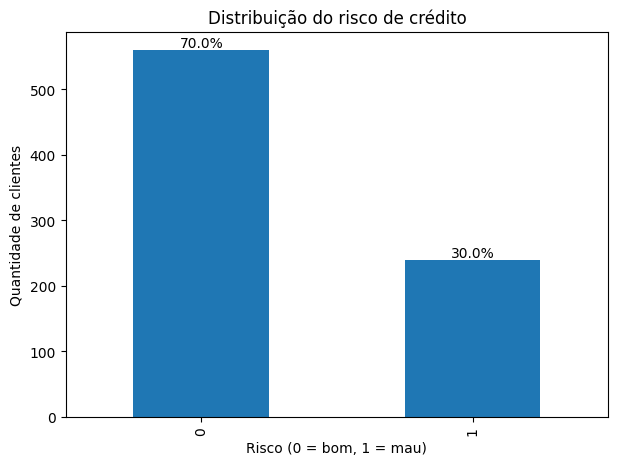
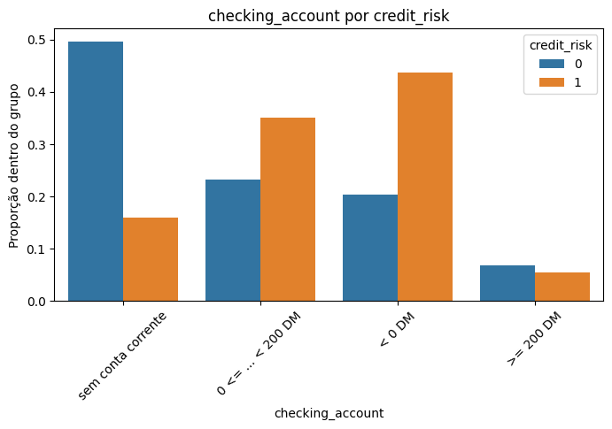
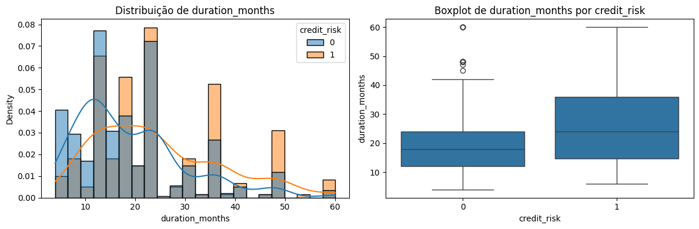
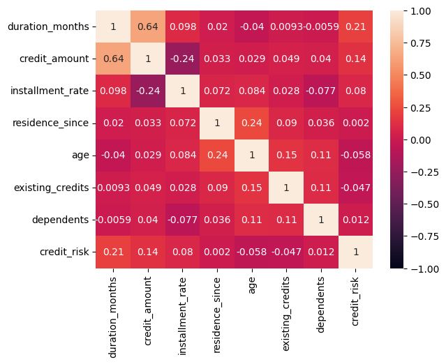
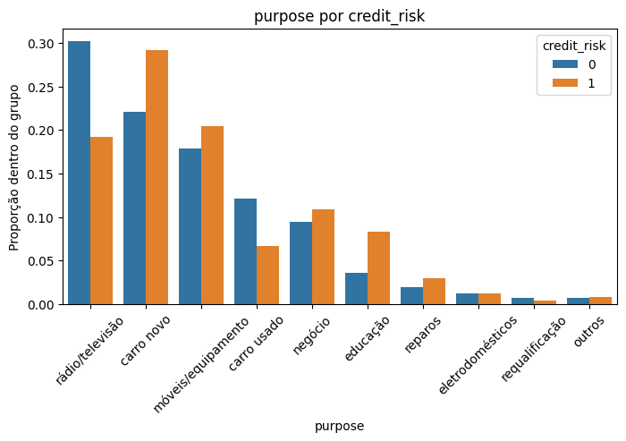
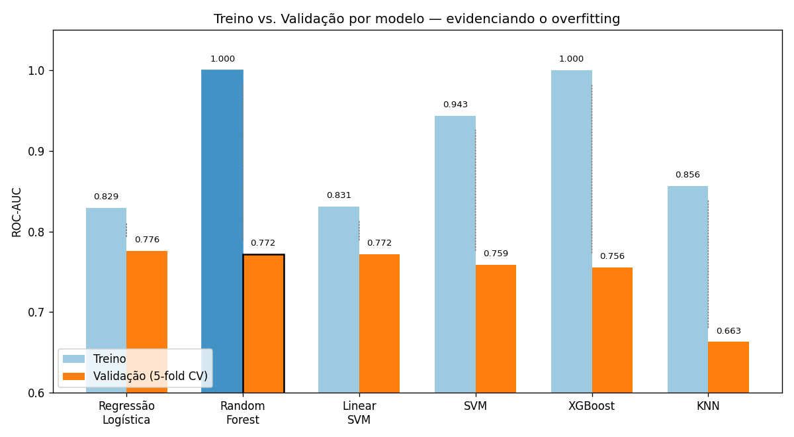
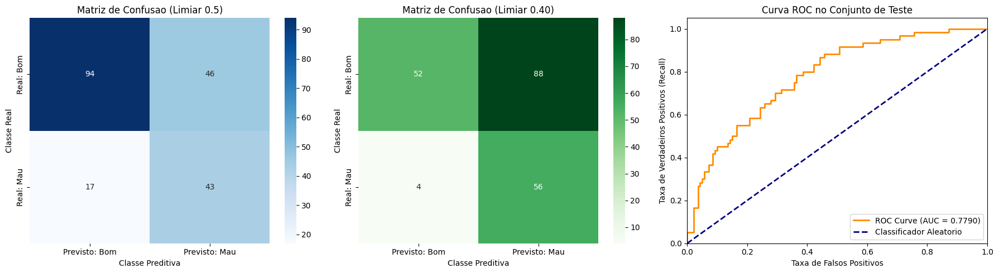
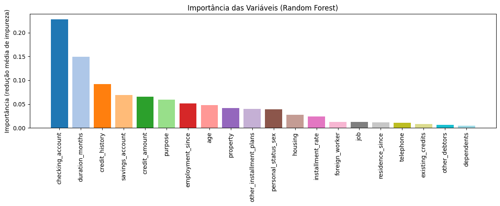

# Previsão de Risco de Crédito com Machine Learning


## 1. Descrição

- Este é um projeto de Machine Learning ponta a ponta que usa Random Forest para prever o risco de crédito de clientes de um banco alemão. É um problema de aprendizado supervisionado de classificação binária, em que o alvo é 1 se o cliente é um mau pagador (inadimplente) e 0 se é um bom pagador.
- O desenvolvimento foi dividido em dois notebooks, seguindo a estrutura CRISP-DM: `EDA_credit.ipynb`, com a definição do problema, coleta dos dados e análise exploratória; e `modelagem_v5.ipynb`, com o tratamento dos dados, comparação e ajuste de modelos, e avaliação final. As funções auxiliares de cada etapa foram organizadas em módulos Python separados (`EDA_utils.py` e `modelagem_utils.py`), importados nos notebooks, para manter o código mais limpo e reutilizável.

## 2. Tecnologias e ferramentas

- Python (Pandas, NumPy, Matplotlib, Seaborn, Scikit-Learn, Category-Encoders, XGBoost), Jupyter Notebook, algoritmos de classificação de Machine Learning e estatística.

## 3. Problema de negócio e objetivo

Risco de crédito é a possibilidade de um cliente não conseguir honrar um compromisso financeiro assumido — ou seja, não pagar total ou parcialmente um empréstimo, financiamento ou dívida contraída junto a uma instituição financeira.

É o principal risco que uma instituição financeira enfrenta na sua atividade central de emprestar dinheiro. Quando um cliente não paga, o banco perde não só o valor emprestado, mas também os juros que esperava receber, além de arcar com custos de cobrança e recuperação. Multiplicado por milhares de clientes, isso pode comprometer seriamente a saúde financeira da instituição.

Historicamente, essa avaliação era feita manualmente por analistas. Hoje, a maioria dos bancos usa modelos de credit scoring — sistemas de Machine Learning que estimam a probabilidade de inadimplência com base no histórico de clientes anteriores. É esse tipo de modelo que este projeto constrói.

Diante disso, os objetivos do projeto são:

1. Identificar, a partir da análise exploratória, quais fatores estão mais associados ao risco de crédito.
2. Construir um modelo capaz de estimar a probabilidade de um novo cliente ser um mau pagador, usando o ROC-AUC como métrica principal de otimização.
3. Traduzir essa probabilidade em uma decisão de negócio (aprovar ou recusar o crédito), deixando explícito que esse ponto de corte depende da estratégia de risco do banco.

## 4. Pipeline da solução

O projeto seguiu a seguinte pipeline, baseada no framework CRISP-DM:

1. Definir o problema da empresa.
2. Coletar a base de dados e ter uma visão geral dela.
3. Separar em base de treino e teste.
4. Análise exploratória dos dados (EDA).
5. Tratamento e pré-processamento dos dados.
6. Treinamento dos modelos, comparação e ajuste de hiperparâmetros (tuning).
7. Avaliação do modelo final no conjunto de teste.
8. Conclusões.

Cada etapa está detalhada nos notebooks, com a justificativa das decisões tomadas ao longo do caminho.

## 5. Principais insights de negócio (EDA)

A base tem 1.000 clientes, com um desbalanceamento moderado entre as classes: 70% bons pagadores e 30% maus pagadores.


1. Status da conta corrente é o fator mais associado ao risco. Clientes sem conta corrente no banco apresentam, proporcionalmente, o menor risco entre todos os grupos — um resultado contraintuitivo à primeira vista, mas que faz sentido: quem não tem conta corrente também não tem esse tipo de histórico para o banco avaliar, tornando a leitura menos direta do que "menos saldo, mais risco".



2. Prazo e valor do crédito estão entre os fatores mais associados ao risco: prazos mais longos e valores de empréstimo mais altos aparecem associados a mais inadimplência. As duas variáveis também são fortemente correlacionadas entre si (0,64), sugerindo que "pedidos maiores e mais longos" formam um perfil de risco combinado, não dois efeitos independentes.





3. A finalidade do crédito também importa: pedidos para educação, carro novo e negócios concentram mais risco que outras finalidades, como eletrodomésticos ou reparos.



4. Maus pagadores representam 30% dos clientes, mas correspondem a 35,33% do valor total emprestado — uma fatia desproporcional ao tamanho do grupo, o que reforça o custo real da inadimplência para o banco.
5. Clientes com histórico de crédito "conta crítica/outros créditos existentes" (categoria que soa como a pior) apresentaram, proporcionalmente, *menos* risco do que clientes "em dia até agora". A hipótese mais provável é que o banco já aplica uma filtragem prévia nesses casos, só aprovando novo crédito quando há forte indício de pagamento.

## 6. Modelagem

1. Para o pré-processamento, as variáveis categóricas de baixa cardinalidade foram tratadas com One-Hot Encoding, e a variável de maior cardinalidade (finalidade do crédito, com 10 categorias) com Target Encoding. A decisão de não usar Ordinal Encoding para nenhuma categórica veio de checar, uma a uma, se a ordem "óbvia" das categorias realmente correspondia a uma relação monotônica com o risco — não correspondia, como o próprio achado do status da conta corrente mostra.
2. Seis modelos foram comparados via validação cruzada estratificada (5 folds), usando ROC-AUC como métrica — mais adequada que acurácia para um problema com classes desbalanceadas. Para cada modelo, medimos o score tanto no treino quanto na validação, para enxergar overfitting, não só o score médio isolado.



3. Regressão Logística e Random Forest ficaram estatisticamente próximos na validação (0,7760 e 0,7721, respectivamente). Mas o gráfico acima mostra personalidades bem diferentes: a Regressão Logística e o Linear SVM têm scores de treino e validação próximos (pouco overfitting), enquanto o Random Forest e o XGBoost memorizam o treino inteiro (ROC-AUC de 1,00) sem que isso se traduza em vantagem na validação. Optamos por levar o Random Forest para a etapa de ajuste de hiperparâmetros justamente por esse overfitting acentuado — havia margem aparente para reduzir a variância do modelo via regularização.
4. O ajuste foi feito com `RandomizedSearchCV`, buscando principalmente parâmetros que limitam o crescimento das árvores (profundidade máxima, mínimo de amostras por divisão e por folha). O resultado confirmou a hipótese só parcialmente: a distância entre o desempenho no treino e na validação caiu de ~0,23 para 0,077, mostrando que o overfitting foi bem controlado. Porém, a métrica de validação teve um ganho marginal, chegando a 0,7820 — no mesmo patamar da Regressão Logística. Isso indica que o teto de desempenho (~0,78) está mais relacionado à informação disponível nos dados do que a uma limitação do algoritmo escolhido.
5. Para transformar a probabilidade estimada em uma decisão de aprovar/recusar, o limiar de decisão foi escolhido usando a matriz de custo oficial do dataset German Credit, que assume que deixar passar um mau pagador custa 5 vezes mais do que recusar um bom pagador por engano (5:1). O limiar foi escolhido usando apenas previsões *out-of-fold* no conjunto de treino, para não usar o conjunto de teste na decisão. É importante frisar que essa proporção de custo é uma política de risco, não uma verdade fixa: um banco com outra estratégia (mais conservadora ou mais agressiva na aprovação) chegaria a um limiar diferente.
6. Com o limiar escolhido (0,40), o modelo, no conjunto de teste, identificou corretamente 93,3% dos maus pagadores (56 de 60), ao custo de recusar 88 dos 140 bons pagadores por cautela. O ROC-AUC no teste foi de 0,7790, consistente com o valor observado na validação cruzada.



7. Por fim, analisamos a importância das variáveis do modelo final. Como o One-Hot Encoding expande uma variável categórica em várias colunas, a importância de cada coluna gerada foi somada de volta à variável original antes do gráfico — do contrário, uma variável como status da conta corrente apareceria fatiada em 3 barras pequenas em vez de uma só. O resultado confirma os padrões identificados na EDA: status da conta corrente, duração do crédito e histórico de crédito são as três variáveis mais relevantes para a previsão.



## 7. Conclusão e próximos passos

O objetivo do projeto — identificar os fatores associados ao risco de crédito e construir um modelo capaz de discriminar bons de maus pagadores — foi atingido, com um ROC-AUC de 0,7790 no conjunto de teste, nunca utilizado durante o desenvolvimento ou a escolha do limiar.

Algumas limitações e possíveis próximos passos ficam registrados com transparência:

- A base tem apenas 1.000 clientes, o que limita a precisão das estimativas e o tamanho do conjunto de teste (200 clientes).
- O limiar de 0,40, derivado da proporção de custo 5:1, implica recusar 63% dos bons pagadores — uma taxa de aprovação provavelmente inviável para um banco na prática. Isso é uma limitação da política de custo assumida, não do modelo, e caberia ao banco calibrar essa proporção de acordo com sua estratégia real.
- Os dados são de 1994, de um banco alemão específico; padrões de risco podem ter mudado e podem não se generalizar para outros mercados ou períodos.
- Próximo passo natural: testar critérios alternativos de escolha do limiar (por exemplo, um recall-alvo, como em outras abordagens de referência para este mesmo problema) e comparar com a abordagem de custo 5:1 usada aqui.

## 8. Como rodar este projeto na sua máquina

Pré-requisitos: Python 3.11+, pip e Git.

1. Clone o repositório e entre na pasta:
```
git clone <url-do-seu-repositorio>
cd <nome-da-pasta>
```

2. (Recomendado) Crie e ative um ambiente virtual:
```
python -m venv venv
source venv/bin/activate  # No Windows: venv\Scripts\activate
```

3. Instale as dependências:
```
pip install pandas numpy matplotlib seaborn scikit-learn category-encoders xgboost jupyter
```

4. Garanta que o arquivo `german.data` está na mesma pasta dos notebooks (`EDA_credit.ipynb`, `modelagem_v5.ipynb`, `EDA_utils.py` e `modelagem_utils.py` também precisam estar todos juntos).

5. Abra o Jupyter a partir dessa pasta e rode, na ordem: `EDA_credit.ipynb` e depois `modelagem_v5.ipynb`.

## 9. Fonte dos dados

O dataset utilizado é o Statlog (German Credit Data), do UCI Machine Learning Repository.

Link: <https://archive.ics.uci.edu/dataset/144/statlog+german+credit+data>

## 10. Contato

- LinkedIn: www.linkedin.com/in/frank-yuji-oka-4140672a1
- E-mail: frankyujioka@gmail.com
